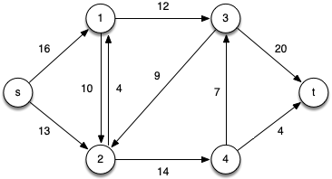
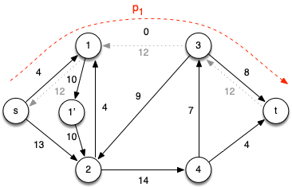
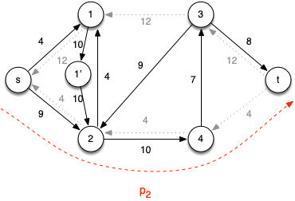
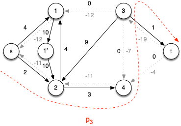
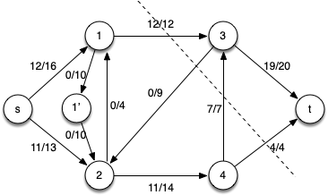

Last lecture provided the framework for maximum flow problems and proved the key theorem - max-flow min-cut - that all algorithms are based on. This lecture we will investigate an algorithm for computing maximal flows known as *Ford-Fulkerson*.

Ford-Fulkerson Algorithm
========================

The *Ford-Fulkerson algorithm* builds upon the general strategy presented last time.

<pre>
	1.  for each edge (u,v) ∈ G.E
	2.     (u,v).f = 0
	3.  while there exists a path p from s to t in the residual network Gf
	4.     cf(p) = min{ cf(u,v) : (u,v) is in p}
	5.     for each edge (u,v) in p
	6.        if (u,v) ∈ E
	7.           (u,v).f = (u,v).f + cf(p)
	8.        else
	9.           (v,u).f = (v,u).f - cf(p)
</pre>

This algorithm runs efficiently as long as the value of the maximal flow \|*f* \*\| is reasonably small or if poor augmenting paths are avoided.

Edmonds-Karp Algorithm
======================

An extension that improves upon the basic Ford-Fulkerson method is the *Edmonds-Karp algorithm*. This algorithm finds the augmenting path using BFS with all edges in the residual network being given a weight of 1. Thus BFS finds a *shortest path* (in terms of number of edges) to use as the augmenting path. With this modification, it can be shown that Edmonds-Karp runs in O(*VE*2).

**Example**

Consider the following flow network

> 

Note that clearly \|*f* \*\| ≤ 24 (the smaller of the capacities leaving the source or entering the sink).

*Iteration 1:* Choose the augmenting path *p*1 = \< *s*, 1, 3, *t* \> which has *c*f(*p*1) = 12 (due to *c*(1,3)) giving the residual network

> 

*Iteration 2:* Choose the augmenting path *p*2 = \< *s*, 2, 4, *t* \> which has *c*f(*p*2) = 4 (due to *c*(4,*t*)) giving the residual network

> 

*Iteration 3:* Choose the augmenting path *p*3 = \< *s*, 2, 4, 3, *t* \> which has *c*f(*p*3) = 7 (due to *c*(4,3)) giving the residual network

> 

At this point there are no other augmenting paths (since vertex 3 is the only vertex with additional capacity to the sink but has no flow in from other vertices). Hence the final flow network with a min-cut shown is

> 

with maximal flow \|*f* \*\| = 19 + 4 = 23 (or 12 + 11 = 23).

